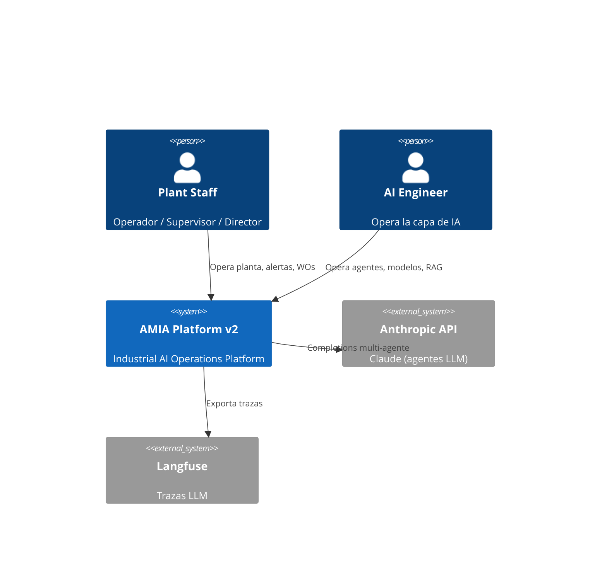

# AMIA Platform v2 — Software Design Document (SDD)

**Proyecto:** AMIA — Autonomous Maintenance Intelligence Agent
**Versión del documento:** 2.0.0
**Audiencia:** Claude Code (agente de desarrollo) + revisor humano (Juan)
**Estado:** Blueprint definitivo aprobado para implementación por etapas

---

## 0. Cómo usar este documento (instrucciones para Claude Code)

Este SDD es el **blueprint canónico** de AMIA v2. Reglas de trabajo:

1. **Ejecuta el proyecto por etapas** (Sección 11). No inicies una etapa sin que la anterior tenga sus criterios de aceptación en verde.
2. **Cada subetapa = una rama + un PR conceptual.** Al terminar una subetapa: ejecutar tests, actualizar `CHANGELOG.md` y marcar la tarea en `docs/backlog.md`.
3. **Ante ambigüedad**, resuelve consultando en este orden: (a) criterios de aceptación del módulo (Sección 8), (b) convenciones (Sección 14), (c) preguntar al usuario.
4. **No implementar autenticación real** (ver ADR-01, Sección 16). Sí implementar el *hook* de identidad simulada descrito en 6.5.
5. **No romper la API v1 existente** hasta la Etapa 5 (los endpoints actuales del README v1 siguen funcionando durante la migración).
6. Todo texto visible en UI en **inglés** (portfolio internacional); comentarios de código en inglés; documentación de negocio puede ir en español.

---

## 1. Visión del producto y objetivos

### 1.1 Contexto

AMIA v1 es un sistema multi-agente de mantenimiento predictivo (LangGraph + Claude, RAG con Qdrant, 3 modelos XGBoost con MLflow, FastAPI, Next.js 14). Funciona, pero se percibe como *"un asistente inteligente con dashboard"*.

AMIA v2 lo transforma en una **plataforma de Industrial AI Operations**: el usuario no solo ve predicciones, sino que **opera** agentes, modelos, RAG y alertas — al estilo IBM Maximo, Honeywell Forge o ABB Ability, pero con foco en la capa de IA.

### 1.2 Objetivos (portfolio AI Engineer, sector industrial)

| # | Objetivo | Cómo lo demuestra v2 |
|---|---|---|
| O1 | Demostrar que sé construir un **producto de IA operable**, no solo modelos | AI Control Center: agentes, modelos, RAG y servicios bajo un panel unificado |
| O2 | Demostrar **LLMOps** real | Trazas por ejecución, coste/tokens, tool calls explorer, evaluación de agentes (groundedness, hallucination rate) |
| O3 | Demostrar **MLOps** real | Versionado MLflow, métricas, drift (Evidently), explicabilidad SHAP integrada en UI |
| O4 | Demostrar **pensamiento de producto industrial** | Fleet View, Asset Detail, Alert Center con ciclo de vida, Work Orders, auditoría |
| O5 | Demostrar **arquitectura y observabilidad** | C4, OpenTelemetry, Prometheus/Grafana, logging estructurado con correlation IDs |

### 1.3 No-objetivos de v2 (decisiones explícitas)

- **Autenticación/Autorización real (OAuth, JWT multiusuario): FUERA.** Justificación en ADR-01. Se sustituye por un **selector de rol simulado** (Demo Identity) que alimenta la auditoría y demuestra el *diseño* RBAC sin su coste de implementación.
- Motor 3D para Digital Twin: fuera. Solo navegación jerárquica Plant → Line → Machine → Sensor con estados de color.
- Multi-tenancy real, facturación, gestión de usuarios: fuera.
- Datos reales de planta: se mantiene el generador sintético, ampliado.

### 1.4 Análisis crítico de la propuesta v2 (priorización)

La propuesta origen (basada en Maximo/Forge/Ability) es correcta en dirección pero desigual en ROI de portfolio:

- **Máximo ROI (núcleo de v2):** AI Control Center + Tool Calls Explorer + ML Center + Agent Evaluation + RAG Dashboard. Es la combinación que casi ningún portfolio muestra junta (agentes + MLOps + LLMOps + observabilidad).
- **ROI alto, coste bajo:** Executive Operations Center y Fleet View reutilizan endpoints v1 (`/metrics/kpis`, `/predict/*/all`) — son mayormente frontend.
- **ROI medio:** Alert Center con ciclo de vida, Asset Detail, Timeline, Logs Explorer, Explainable AI (SHAP ya es viable con XGBoost).
- **ROI bajo para un portfolio de AI Engineer (posponer):** Kanban drag&drop (es UX genérica, no IA), Digital Twin más allá de la navegación jerárquica, PDF reports, simulador de escenarios, multi-planta.
- **Riesgo a vigilar:** duplicar observabilidad. Langfuse ya traza LLM; Prometheus/Grafana deben cubrir *infraestructura y APIs*, no repetir trazas LLM. La UI de AMIA **agrega y resume**; el detalle profundo enlaza a Langfuse/MLflow/Grafana.

---

## 2. Personas y escenarios de uso

| Persona | Necesidad | Pantallas principales | Escenario tipo |
|---|---|---|---|
| **Operador de línea** | Saber qué máquina va a fallar y qué hacer | Fleet View, Asset Detail, Alerts | "Machine 02 al 98% de fallo, RUL 18h → abre la alerta, revisa recomendación del agente, confirma WO" |
| **Supervisor de turno** | Gestionar alertas y órdenes de trabajo | Alert Center, Work Orders, Timeline | "Triage matinal: reconoce 3 alertas, asigna 2 WO, escala 1 caso" |
| **Responsable de mantenimiento** | Trazabilidad y justificación de decisiones | Asset Timeline, Explainable AI, Audit Trail | "¿Por qué se generó esta WO? → timeline: vibración → modelo 95% → RCA bearing wear → coste → WO" |
| **Director de planta** | Salud global y riesgo económico | Executive Operations Center | "Plant Health 87%, riesgo económico del día, RUL medio de flota" |
| **AI Engineer / MLOps (tú en la demo)** | Operar la capa de IA | AI Control Center, ML Center, RAG Center, Monitoring, Logs | "El synthesizer subió de latencia → Tool Calls Explorer → un retrieval lento en Qdrant → RAG Dashboard confirma similitud media baja → reindexa" |

Cada escenario anterior debe ser **reproducible en la demo** con datos sintéticos (ver Etapa 0: seeder de demo).

---

## 3. Arquitectura (modelo C4)

### 3.1 Nivel 1 — Context



### 3.2 Nivel 2 — Containers

| Container | Tecnología | Responsabilidad |
|---|---|---|
| **Web App** | Next.js 14 (App Router) + Tailwind + shadcn/ui + TanStack Query + Recharts | Toda la UI v2 (13 módulos, menú lateral) |
| **API Backend** | FastAPI 0.6.x + Pydantic v2 + SQLAlchemy 2.0 async | API REST/OpenAPI, orquestación, dominio |
| **Agent Runtime** | LangGraph (Supervisor + 5 agentes) | Ejecución multi-agente; emite eventos `agent_run`/`tool_call` |
| **ML Serving** | XGBoost + MLflow registry | failure / RCA / RUL; SHAP para XAI |
| **Vector Store** | Qdrant | RAG (colección `amia_docs`) |
| **PostgreSQL** *(nuevo en v2)* | PostgreSQL 16 | Estado operacional: alertas, WOs, auditoría, runs de agentes, tool calls, evaluaciones, configuración |
| **Redis** | Redis 7 | Sesiones chat, semantic cache, rate limiting, pub/sub de eventos en vivo |
| **Observability Stack** | Langfuse, Evidently, Prometheus, Grafana, OpenTelemetry Collector | Trazas LLM, drift, métricas infra, dashboards técnicos |

> **Decisión (ADR-02):** v1 no tenía PostgreSQL; el estado operacional (alertas con ciclo de vida, auditoría, runs) exige persistencia relacional. Parquet sigue siendo la fuente de datos de sensores para ML.

### 3.3 Nivel 3 — Components (API Backend)

```
backend/app/
  api/            # Routers FastAPI por módulo (thin controllers)
  domain/         # Servicios de dominio (alerting, work_orders, audit, fleet, ...)
  agents/         # LangGraph: grafo, nodos, tools, instrumentación
  ml/             # Carga de modelos, inferencia, SHAP, drift
  rag/            # Ingesta, retrieval, métricas RAG
  observability/  # OTel, métricas Prometheus, logging estructurado, Langfuse client
  infra/          # DB (SQLAlchemy), Redis, Qdrant clients, settings
  events/         # Event bus interno (pub/sub Redis) + esquemas de eventos
```

Componentes clave y dependencias:

- `agents/instrumentation.py` — decorador/callback que envuelve cada nodo LangGraph: persiste `agent_run` + `tool_call` en PostgreSQL, exporta span OTel y traza Langfuse, publica evento Redis para UI en vivo.
- `domain/alerting.py` — motor de reglas: evalúa predicciones/lecturas contra umbrales configurables → crea `Alert`; ciclo de vida (new → acknowledged → assigned → resolved).
- `domain/audit.py` — middleware + servicio: toda mutación (POST/PATCH/DELETE) registra actor (identidad demo), acción, entidad, diff.
- `ml/explain.py` — SHAP values por predicción + top features + casos históricos similares (kNN sobre features).
- `rag/metrics.py` — por consulta: latencia retrieval, similitud media, fuentes, hit/miss (threshold de similitud).

---

## 4. Modelo de datos

### 4.1 PostgreSQL (nuevo, esquema `amia`)

Migraciones con **Alembic**. Tablas (todas con `id UUID pk`, `created_at`, `updated_at`):

```sql
-- Identidad demo (sin auth real; ver ADR-01)
demo_users(id, name, role)                    -- role: operator|supervisor|maintenance_manager|plant_director|ai_engineer

-- Activos
machines(id, code, name, line_id, status)     -- status cache: healthy|warning|critical
lines(id, code, name, plant_id)
plants(id, code, name)

-- Capa de IA
agent_runs(id, session_id, agent_name, parent_run_id, started_at, finished_at,
           latency_ms, input_summary, output_summary, reasoning_summary,
           model, input_tokens, output_tokens, cost_usd, status, error, retries)
tool_calls(id, agent_run_id, tool_name, started_at, latency_ms,
           input JSONB, output JSONB, confidence, status, error)
rag_queries(id, agent_run_id, query, top_k, retrieval_latency_ms,
            avg_similarity, sources JSONB, hit BOOLEAN)
agent_evaluations(id, agent_run_id, accuracy, groundedness, hallucination_flag,
                  tool_success_rate, evaluator, notes)      -- LLM-as-judge batch
model_predictions(id, machine_id, model_name, model_version, prediction JSONB,
                  probability, shap_top_features JSONB, created_at)

-- Operación
alerts(id, machine_id, severity, source, title, description, status,
       acknowledged_by, assigned_to, resolved_at, prediction_id, work_order_id)
       -- severity: critical|high|medium|low ; status: new|acknowledged|assigned|resolved
work_orders(id, machine_id, alert_id, title, description, priority, status,
            assigned_to, estimated_cost, created_by_agent_run_id)
            -- status: open|assigned|in_progress|completed
audit_log(id, actor_id, actor_type, action, entity_type, entity_id,
          diff JSONB, correlation_id, created_at)  -- actor_type: user|agent|system
timeline_events(id, machine_id, ts, kind, title, payload JSONB, correlation_id)
       -- kind: sensor_anomaly|prediction|agent_decision|rca|economic|wo_created|alert_*

-- Plataforma
platform_config(key TEXT pk, value JSONB, updated_by, updated_at)
       -- llm.temperature, llm.max_tokens, rag.top_k, rag.chunk_size,
       -- thresholds.failure, thresholds.economic, ...
```

Índices mínimos: `agent_runs(session_id)`, `tool_calls(agent_run_id)`, `alerts(status, severity)`, `timeline_events(machine_id, ts)`, `audit_log(entity_type, entity_id)`, `model_predictions(machine_id, created_at)`.

### 4.2 Redis (convención de claves)

| Clave | Tipo | Uso | TTL |
|---|---|---|---|
| `chat:session:{id}` | list | Historial de sesión | 24h |
| `cache:semantic:{hash}` | string | Semantic cache respuestas | 1h |
| `rl:{ip}:{route}` | counter | Rate limiting | ventana |
| `events:live` | pub/sub | Eventos en vivo hacia UI (SSE) | — |
| `health:{service}` | string | Último heartbeat por servicio | 60s |

### 4.3 Qdrant

- Colección `amia_docs`: payload `{source, doc_type, chunk_index, ingested_at}`. Sin cambios de esquema; v2 añade **endpoint de inspección** (listado de documentos/chunks) y métricas.

### 4.4 Datos de sensores

- `sensor_readings.parquet` sigue como fuente de entrenamiento. El generador sintético v2 añade: eventos etiquetados para **escenario de demo determinista** (semilla fija) que dispara el flujo completo (anomalía → predicción → alerta → WO) al arrancar.

---

## 5. Modelo de eventos y flujos LangGraph

### 5.1 Grafo (sin cambios de topología respecto a v1)

```
Supervisor (haiku) ─route─► doc_expert ─────────────────────────────► synthesizer
                     ├────► sensor_analyst ─► [ok] ─────────────────► synthesizer
                     │                     └► rul_analyst ─► economic_analyst ─► wo_creator ─► synthesizer
                     ├────► rul_analyst ────────────────────────────► synthesizer
                     └────► synthesizer
```

### 5.2 Instrumentación (lo nuevo de v2)

Cada nodo se ejecuta envuelto por `instrument_agent(name)`:

1. Crea `agent_run` (estado `running`) con `parent_run_id` = run del supervisor.
2. Cada tool invocada registra `tool_call` (input/output/latencia/confidence).
3. Al finalizar: actualiza tokens/coste (usage de la API), `reasoning_summary` (resumen de 1-2 frases generado por el propio nodo), estado `success|error`.
4. Exporta: span OTel (traceparent = correlation_id), traza Langfuse, evento `events:live`.
5. Si el flujo genera decisiones sobre una máquina → inserta `timeline_events`.

### 5.3 Esquema de evento (Redis pub/sub → SSE frontend)

```json
{
  "type": "agent_run.finished | tool_call.finished | alert.created | wo.created | prediction.created | service.health",
  "ts": "ISO-8601",
  "correlation_id": "uuid",
  "payload": { }
}
```

El frontend consume `GET /events/stream` (SSE) para actualizar en vivo el AI Control Center, Alert Center y Fleet View. **No usar WebSockets** (SSE es suficiente y más simple).

---

## 6. Diseño de APIs (FastAPI / OpenAPI)

Prefijo v2: `/api/v2`. Los endpoints v1 se mantienen hasta Etapa 5. Todos los routers con `response_model` Pydantic, paginación `?limit=&offset=`, filtros documentados en OpenAPI.

### 6.1 Operations / Fleet / Assets

| Endpoint | Método | Descripción |
|---|---|---|
| `/api/v2/operations/summary` | GET | KPIs ejecutivos agregados (health score, riesgo, IA, alertas) |
| `/api/v2/fleet` | GET | Lista de máquinas: status, prob. fallo, RUL, alertas abiertas |
| `/api/v2/assets/{machine_id}` | GET | Asset overview completo |
| `/api/v2/assets/{machine_id}/timeline` | GET | Eventos de timeline (filtros: kind, rango) |
| `/api/v2/assets/{machine_id}/sensors` | GET | Series temporales recientes (downsampled) |

### 6.2 AI Control Center

| Endpoint | Método | Descripción |
|---|---|---|
| `/api/v2/agents/summary` | GET | Tarjetas por agente: status, latencia p50/p95, calls, success rate, coste, tokens |
| `/api/v2/agents/runs` | GET | Listado de runs (filtros: agent, status, session, rango) |
| `/api/v2/agents/runs/{run_id}` | GET | Detalle: input/output/reasoning/tool calls/costes/retries |
| `/api/v2/agents/runs/{run_id}/trace` | GET | Árbol completo supervisor→agentes→tools (Tool Calls Explorer) |
| `/api/v2/agents/evaluations` | GET/POST | Resultados de evaluación; POST lanza batch LLM-as-judge |

### 6.3 ML Center / XAI / RAG

| Endpoint | Método | Descripción |
|---|---|---|
| `/api/v2/models` | GET | Modelos registrados (MLflow): versión, métricas, fecha, features |
| `/api/v2/models/{name}/metrics` | GET | ROC, confusion matrix, feature importance, distribución de predicciones |
| `/api/v2/models/{name}/drift` | GET | Resumen Evidently + enlace a informe HTML |
| `/api/v2/predictions/{id}/explain` | GET | SHAP top features + confianza + casos históricos similares |
| `/api/v2/rag/summary` | GET | Docs indexados, chunks, latencia retrieval, similitud media, miss rate, top sources |
| `/api/v2/rag/documents` | GET | Inspección de documentos/chunks en Qdrant |
| `/api/v2/rag/queries` | GET | Últimas consultas RAG con métricas |

### 6.4 Operación de plataforma

| Endpoint | Método | Descripción |
|---|---|---|
| `/api/v2/alerts` | GET/POST | Listado con filtros; creación manual |
| `/api/v2/alerts/{id}` | PATCH | Transiciones: acknowledge / assign / resolve |
| `/api/v2/work-orders` | GET/POST/PATCH | CRUD + transición de estado (columnas Kanban) |
| `/api/v2/logs` | GET | Explorador: filtros por service, agent, severity, correlation_id, texto |
| `/api/v2/audit` | GET | Auditoría con filtros por actor/entidad/acción |
| `/api/v2/monitoring/services` | GET | Salud de FastAPI, Redis, Qdrant, MLflow, Langfuse, Postgres, workers |
| `/api/v2/config` | GET/PATCH | Configuración de plataforma (validada con Pydantic; PATCH audita) |
| `/api/v2/events/stream` | GET | SSE de eventos en vivo |
| `/metrics` | GET | Exposición Prometheus (instrumentator) |

### 6.5 Identidad demo (sustituto de Auth — ADR-01)

- Header opcional `X-Demo-User: <demo_user_id>`; middleware lo resuelve contra `demo_users` y lo inyecta en `request.state.actor`. Sin header → actor `system`.
- El frontend expone un **selector de rol** en la topbar (persistido en localStorage) y lo envía en cada request.
- La auditoría y las asignaciones (alerts/WOs) usan este actor. RBAC **visual**: el frontend oculta acciones según rol (documentado, no exigido por backend).
- Esto deja el *seam* preparado: sustituir el middleware por JWT real en el futuro no toca dominio ni UI.

---

## 7. Frontend — especificación técnica y UX/UI

### 7.1 Stack y arquitectura

- **Next.js 14 App Router**, TypeScript estricto.
- **shadcn/ui** como sistema de componentes (Card, Table, Badge, Tabs, Sheet, Dialog, Command, Toast/Sonner, DropdownMenu, Select, Skeleton).
- **TanStack Query** para data fetching (staleTime por recurso; invalidación vía eventos SSE).
- **Recharts** para gráficos (ROC, distribuciones, series de sensores, barras SHAP).
- **Zustand** solo para estado global mínimo (identidad demo, filtros persistentes).
- Tema oscuro por defecto (estética industrial tipo Forge/Grafana), tokens CSS custom sobre Tailwind.

```
frontend/src/
  app/(platform)/
    dashboard/ assets/ assets/[id]/ agents/ agents/runs/[id]/
    models/ models/[name]/ rag/ alerts/ work-orders/
    evaluation/ monitoring/ logs/ audit/ settings/
  components/
    layout/ (Sidebar, Topbar, DemoUserSwitcher, LiveIndicator)
    kpi/ charts/ agents/ ml/ rag/ alerts/ shared/
  lib/ (api client tipado desde OpenAPI, sse.ts, format.ts)
  hooks/ (useLiveEvents, useFleet, useAgentRuns, ...)
```

### 7.2 Navegación (menú lateral)

`Dashboard · Assets · Agents · Models · RAG · Evaluation · Alerts · Work Orders · Monitoring · Logs · Audit · Settings`

Topbar: breadcrumb, LiveIndicator (SSE conectado), selector de identidad demo, salud global (dot verde/ámbar/rojo).

### 7.3 Wireframes (uno por pantalla; representativos)

**W-01 Executive Operations Center (`/dashboard`)**
```
┌───────────────────────────────────────────────────────────────────┐
│ PLANT HEALTH  87% ◉        Failure Risk Today   Economic Risk     │
│ [gauge/score]              [12%  ▲]             [€4.2k  ▼]        │
├──────────────┬──────────────┬──────────────┬──────────────────────┤
│ Machines     │ AI           │ Alerts       │ Avg Fleet RUL        │
│ ●3 ●1 ●1     │ Acc 91% ML ✓ │ 2 critical   │ 186h                 │
│ (H/W/C)      │ RAG ✓ $0.42  │ 5 pending WO │ [sparkline]          │
├──────────────┴──────────────┴──────────────┴──────────────────────┤
│ [Fleet risk chart 24h]            [Recent critical events feed]   │
└───────────────────────────────────────────────────────────────────┘
```

**W-02 Fleet View (`/assets`)** — grid de MachineCards:
```
┌ Machine 01 ──────────┐ ┌ Machine 02 ──────────┐
│ ● Healthy            │ │ ● Critical           │
│ Failure 8%  RUL 234h │ │ Failure 98%  RUL 18h │
│ [mini trend] 0 alerts│ │ [mini trend] 2 alerts│
└──────────[Detail →]──┘ └──────────[Detail →]──┘
```

**W-03 Asset Detail (`/assets/[id]`)** — Tabs: `Overview | Sensors | Timeline | Work Orders | Explainability | Documents`. Overview: status, prob. fallo, RUL, última recomendación del agente. Timeline vertical:
```
08:31 ⚠ High vibration (sensor)
08:34 ◆ Failure model v1.4 → 95%
08:35 ▣ Supervisor routed → sensor_analyst
08:36 ◆ RCA: Bearing Wear (conf 0.87)
08:37 € Economic impact: €12.4k downtime risk
08:38 ✔ WO-0042 generated                    [View trace →]
```

**W-04 AI Control Center (`/agents`)** — tarjetas por agente + tabla de runs:
```
┌ Supervisor ─────────┐ ┌ Sensor Analyst ─────┐ ┌ RAG Agent ─────────┐
│ ● online  p95 820ms │ │ p95 2.1s  err 0.4%  │ │ p95 1.3s  hit 92%  │
│ 1,204 calls  98.7%  │ │ 18.2k tok  $0.31    │ │ 640 calls          │
└─────────────────────┘ └─────────────────────┘ └────────────────────┘
Runs ▾ filter: agent|status|session
│ time │ agent │ latency │ tokens │ cost │ status │ [trace] │
```

**W-05 Trace / Tool Calls Explorer (`/agents/runs/[id]`)** — árbol colapsable:
```
▼ Supervisor (820ms, $0.002)          input: "Why is M02 at risk?"
  ▼ sensor_analyst (2.1s)
      ├ tool: failure_prediction  (140ms, conf 0.98)  [in][out]
      ├ tool: rul_estimate        (95ms)              [in][out]
  ▼ economic_analyst (1.8s)
      └ tool: economic_impact     (60ms)              [in][out]
  ▼ synthesizer (1.2s)  reasoning: "Combined sensor+economic..."
Answer ▸ ...                                  [Open in Langfuse ↗]
```

**W-06 ML Center (`/models`, `/models/[name]`)** — por modelo: versión, fecha, features, ROC curve, confusion matrix, feature importance, distribución de predicciones, panel de drift (Evidently) con enlace al HTML.

**W-07 Agent Evaluation (`/evaluation`)** — KPIs: response accuracy, hallucination rate, tool success, groundedness, latencia, coste por query; tabla de evaluaciones; botón "Run evaluation batch".

**W-08 RAG Dashboard (`/rag`)** — Docs indexed, chunks, embeddings model, retrieval latency p50/p95, avg similarity, miss rate, top sources (bar), tabla de últimas queries; inspector de documento (Sheet lateral con chunks).

**W-09 Alert Center (`/alerts`)** — tabla con severidad (badges), estado, máquina, fuente; acciones fila: Acknowledge / Assign (a demo user) / Resolve; filtros y contador por severidad.

**W-10 Work Orders (`/work-orders`)** — Kanban 4 columnas (Open/Assigned/In Progress/Completed). MVP: mover con menú contextual; drag&drop solo si sobra tiempo (dnd-kit).

**W-11 Monitoring (`/monitoring`)** — grid de servicios (FastAPI, Postgres, Redis, Qdrant, MLflow, Langfuse, Evidently, workers): estado, latencia, uptime, última señal; enlaces a Grafana.

**W-12 Logs Explorer (`/logs`)** — tabla virtualizada: ts, service, agent, severity, correlation_id, message; filtros combinables; click en correlation_id → filtra toda la traza transversal.

**W-13 Audit Trail (`/audit`)** — tabla: actor (user/agent/system), acción, entidad, diff (Dialog), timestamp.

**W-14 Settings (`/settings`)** — formularios agrupados: LLM (model, temperature, max_tokens), RAG (top_k, chunk_size, embedding model), Thresholds (failure, economic); guardar → PATCH `/config` (auditado) + toast.

**W-15 Digital Twin ligero (`/assets` vista "hierarchy")** — árbol Plant → Line → Machine → Sensors con dots de estado; click navega a Asset Detail. *(NICE TO HAVE)*

### 7.4 Componentes compartidos clave

`KpiCard`, `StatusBadge(severity|health)`, `TrendSparkline`, `AgentCard`, `RunTraceTree`, `ShapBarChart`, `SeverityFilterBar`, `CorrelationLink`, `LiveDot`, `EmptyState`, `PageSkeleton`.

---

## 8. Especificaciones funcionales y criterios de aceptación por módulo

> Formato: **F-XX Módulo — prioridad**. Los criterios (CA) son la definición de done por módulo.

**F-01 Executive Operations Center — MUST**
- CA1: `/dashboard` carga en <1s con datos del seeder; muestra Plant Health Score (fórmula: media ponderada de salud de máquinas 50%, inverso de riesgo económico normalizado 25%, IA health 25%; documentada en `domain/health.py`).
- CA2: Los 4 bloques (Production/Machines/Risk/AI/Alerts) provienen de **una sola** llamada a `/operations/summary`.
- CA3: Un evento SSE `alert.created` actualiza el contador de alertas sin recargar.

**F-02 Fleet View — MUST**
- CA1: Grid con todas las máquinas, status coherente con umbrales de `platform_config`.
- CA2: Click en tarjeta navega a Asset Detail. CA3: filtro por status.

**F-03 Asset Detail + Timeline — MUST (timeline SHOULD si aprieta)**
- CA1: Tabs Overview/Sensors/Timeline/WOs/Explainability con datos reales del seeder.
- CA2: Timeline muestra la secuencia completa del escenario de demo (anomalía→WO) ordenada, con enlace "View trace" al run correspondiente.

**F-04 AI Control Center — MUST (núcleo)**
- CA1: Toda ejecución del grafo (vía `/process_input` o pipeline batch) genera `agent_run` + `tool_calls` persistidos.
- CA2: Tarjetas por agente con p50/p95, calls, success rate, tokens y coste (agregados SQL, no en memoria).
- CA3: Detalle de run muestra input, output, reasoning_summary, tool calls con IO, retries y errores.
- CA4: Coste calculado desde usage real de la API (tabla de precios en config).

**F-05 Tool Calls Explorer — MUST**
- CA1: Árbol jerárquico completo por correlation_id (supervisor→agentes→tools).
- CA2: Cada nodo expande input/output (JSON viewer) y latencia. CA3: enlace a Langfuse.

**F-06 ML Center — MUST**
- CA1: Lista modelos desde MLflow (nombre, versión activa, fecha, métricas registradas).
- CA2: Gráficos ROC, confusion matrix, feature importance renderizados desde `/models/{name}/metrics` (artefactos calculados en evaluate y cacheados en JSON).
- CA3: Panel drift con verdict de Evidently y enlace al informe HTML.

**F-07 Agent Evaluation — MUST**
- CA1: Batch LLM-as-judge (Claude) sobre N runs recientes: groundedness (respuesta vs. fuentes RAG), hallucination_flag, accuracy 1-5; persistido en `agent_evaluations`.
- CA2: Dashboard agrega métricas por agente y por semana. CA3: ejecutable desde UI y CLI.

**F-08 RAG Dashboard — MUST**
- CA1: Métricas por consulta persistidas en `rag_queries` (instrumentación del retriever).
- CA2: Summary correcto: docs, chunks, latencias, similitud media, miss rate (similitud < umbral config).
- CA3: Inspector de documentos lista chunks reales de Qdrant.

**F-09 Alert Center — MUST**
- CA1: El motor de alertas crea alertas automáticamente cuando prob. fallo > threshold o anomalía crítica de sensor (job periódico + on-prediction).
- CA2: Transiciones de estado válidas y auditadas; asignación a demo users. CA3: filtros por severidad/estado.

**F-10 Explainable AI — MUST**
- CA1: Para cada predicción de fallo: SHAP top-8 features (bar chart), confianza, y 3 casos históricos similares (kNN en espacio de features) con su outcome.
- CA2: Accesible desde Asset Detail y desde la alerta ("Why?").

**F-11 Logs Explorer — MUST**
- CA1: Logging estructurado JSON (structlog) con service/agent/severity/correlation_id en todo el backend; sink a Postgres (tabla `logs` o loki-lite: tabla particionada simple).
- CA2: Filtros combinables + búsqueda de texto; click en correlation_id filtra la traza completa.

**F-12 Work Orders — SHOULD**
- CA1: Kanban 4 estados con transición desde UI (menú); creación automática por agente enlaza alert y run. CA2: auditado.

**F-13 Unified Monitoring — SHOULD**
- CA1: Health checks activos por servicio (ping + latencia) cacheados en Redis; grid en UI. CA2: enlaces a Grafana/MLflow/Langfuse.

**F-14 Audit Trail — SHOULD**
- CA1: Middleware audita toda mutación con actor y diff. CA2: acciones de agentes registradas con `actor_type=agent`.

**F-15 Configuration Center — SHOULD**
- CA1: GET/PATCH validado (Pydantic Settings model); cambios aplican sin reinicio (config store en Postgres + cache Redis con invalidación). CA2: cambio de threshold se refleja en el motor de alertas.

**F-16 Digital Twin ligero, F-17 Predictive Calendar, F-18 PDF Reports, F-19 Scenario Simulator, F-20 Chat contextual por máquina — NICE TO HAVE** (especificar solo si se alcanza la Etapa 6).

---

## 9. MLOps y LLMOps

### 9.1 MLOps

| Práctica | Implementación v2 |
|---|---|
| Registro y versionado | MLflow Model Registry; alias `champion` por modelo; la API sirve siempre el champion |
| Evaluación | `evaluate.py` genera `evaluation_report.json` + artefactos de gráficos (roc.json, cm.json, fi.json, shap_summary.json) consumidos por ML Center |
| Drift | `monitor_drift.py` programado (job) → `drift_summary.json` + HTML; verdict expuesto en API; drift crítico ⇒ alerta `source=ml_drift` |
| Explicabilidad | SHAP TreeExplainer precalculado en background por predicción; almacenado en `model_predictions.shap_top_features` |
| Reproducibilidad | Semillas fijas, dataset versionado por hash en MLflow tags |

### 9.2 LLMOps

| Práctica | Implementación v2 |
|---|---|
| Trazabilidad | Langfuse (traza completa) + persistencia propia (`agent_runs`/`tool_calls`) para la UI operativa |
| Coste | Tabla de precios por modelo en `platform_config`; coste por run/agente/día agregado en SQL |
| Evaluación offline | Batch LLM-as-judge (F-07): groundedness, hallucination, accuracy; dataset dorado de 20 preguntas en `eval/golden_set.json` |
| Guardrails | Ya existentes (rate limit); añadir timeout y retry con backoff por nodo, circuit breaker si Anthropic API falla |
| Caching | Semantic cache Redis (v1) + métrica cache hit-rate expuesta en Performance |

---

## 10. Observabilidad

**Principio (evitar duplicación):** Langfuse = detalle de trazas LLM · MLflow/Evidently = ciclo de vida ML · Prometheus/Grafana = infraestructura y API · **AMIA UI = capa operativa que agrega y enlaza** a las anteriores.

| Capa | Herramienta | Qué se instrumenta |
|---|---|---|
| Métricas API | `prometheus-fastapi-instrumentator` | latencia por ruta, RPS, errores, p95 |
| Métricas negocio | Prometheus custom | predicciones/h, alertas creadas, coste LLM/h, cache hit rate, RAG miss rate |
| Trazas | OpenTelemetry SDK → OTel Collector | spans request→agente→tool→DB; `correlation_id` = trace_id |
| Logs | structlog JSON → Postgres (+stdout) | todo el backend; nivel configurable |
| Dashboards técnicos | Grafana (provisioned JSON en `infra/grafana/`) | 2 dashboards: API/Infra y AI Ops |
| Salud | health checks activos + heartbeats Redis | F-13 |

---

## 11. Roadmap por etapas y subetapas (plan de ejecución para Claude Code)

> Cada etapa termina con: tests en verde, seeder de demo funcionando, CHANGELOG actualizado. Estimaciones en sesiones de trabajo (~2-4h efectivas con Claude Code).

### ETAPA 0 — Fundaciones (habilita todo lo demás) · MUST
- **0.1 PostgreSQL + Alembic**: añadir Postgres a docker-compose; SQLAlchemy 2.0 async; migración inicial con todas las tablas de 4.1; fixtures pytest con DB efímera.
- **0.2 Identidad demo**: tabla `demo_users` + seed (5 roles); middleware `X-Demo-User`; selector en frontend (puede esperar a Etapa 3).
- **0.3 Logging estructurado + correlation_id**: structlog, middleware que genera/propaga `correlation_id`, sink Postgres.
- **0.4 Event bus**: publisher Redis + endpoint SSE `/events/stream` + hook `useLiveEvents` en frontend.
- **0.5 Seeder de demo**: script `seed_demo.py` — genera el escenario determinista (Machine 02 crítico, timeline completo, runs de ejemplo, alertas, WOs). *Sin esto no hay demo reproducible.*
- **0.6 Reestructura backend** según 3.3 (mover código v1 a `api/ domain/ infra/` sin cambiar comportamiento; tests de humo v1 siguen pasando).

### ETAPA 1 — Instrumentación de la capa de IA · MUST
- **1.1** `instrument_agent` en LangGraph: persistencia `agent_runs` + `tool_calls` + eventos.
- **1.2** Instrumentación RAG (`rag_queries`) y de predicciones (`model_predictions` con SHAP en cola background).
- **1.3** Motor de alertas (`domain/alerting.py`) + job periódico + transiciones de estado.
- **1.4** Auditoría (middleware + servicio) y `timeline_events`.
- **1.5** Config store (`platform_config` + cache Redis + Pydantic validation).

### ETAPA 2 — API v2 · MUST
- **2.1** Routers operations/fleet/assets (6.1). **2.2** Routers agents (6.2). **2.3** Routers models/xai/rag (6.3). **2.4** Routers alerts/WOs/logs/audit/monitoring/config (6.4).
- **2.5** OpenAPI limpio + generación de cliente TypeScript (`openapi-typescript`) para el frontend.
- **2.6** Tests de integración por router (httpx + DB efímera) — objetivo ≥80% cobertura en `api/` y `domain/`.

### ETAPA 3 — Frontend núcleo · MUST
- **3.1** Layout: sidebar, topbar, DemoUserSwitcher, LiveIndicator, tema oscuro, design tokens.
- **3.2** Dashboard (W-01) + Fleet View (W-02).
- **3.3** AI Control Center (W-04) + Trace Explorer (W-05). ← *prioridad absoluta*
- **3.4** Asset Detail + Timeline (W-03).
- **3.5** Alert Center (W-09).

### ETAPA 4 — Frontend IA/ML/RAG · MUST
- **4.1** ML Center (W-06) con gráficos desde artefactos de evaluación.
- **4.2** Explainable AI (F-10) integrado en Asset Detail y Alertas.
- **4.3** RAG Dashboard (W-08).
- **4.4** Agent Evaluation (W-07) + batch LLM-as-judge + golden set.
- **4.5** Logs Explorer (W-12).

### ETAPA 5 — Operación de plataforma · SHOULD
- **5.1** Work Orders Kanban (W-10, sin drag&drop). **5.2** Monitoring unificado (W-11) + Prometheus/Grafana provisioning + OTel. **5.3** Audit Trail (W-13). **5.4** Settings (W-14). **5.5** Deprecación limpia de endpoints v1 duplicados; README v2; vídeo/GIFs de demo.

### ETAPA 6 — Diferenciadores opcionales · NICE TO HAVE
- 6.1 Digital Twin ligero (W-15) · 6.2 Drag&drop Kanban · 6.3 Chat contextual por máquina · 6.4 Predictive calendar · 6.5 PDF report generator · 6.6 Scenario simulator.

**Regla de corte para portfolio:** si hay que parar, el producto es presentable al final de la Etapa 4.

---

## 12. Backlog (épicas → features → tareas)

| Épica | Feature | Tareas clave | Etapa |
|---|---|---|---|
| E1 Data & Platform Foundations | Postgres/Alembic, demo identity, logging, events, seeder, restructure | 0.1–0.6 | 0 |
| E2 AI Instrumentation | agent runs, tool calls, RAG metrics, predictions+SHAP, alert engine, audit, config | 1.1–1.5 | 1 |
| E3 Platform API v2 | routers 6.1–6.4, OpenAPI client, tests | 2.1–2.6 | 2 |
| E4 Operations UX | layout, dashboard, fleet, asset detail, alerts | 3.1–3.5 | 3 |
| E5 AI Ops UX | control center, trace explorer, ML center, XAI, RAG, evaluation, logs | 3.3–4.5 | 3–4 |
| E6 Platform Ops | WOs, monitoring+Prometheus/Grafana/OTel, audit UI, settings, cleanup v1 | 5.1–5.5 | 5 |
| E7 Differentiators | twin, dnd, chat contextual, calendar, pdf, simulator | 6.x | 6 |

(El detalle tarea-a-tarea vive en `docs/backlog.md`, que Claude Code debe generar en la subetapa 0.6 a partir de esta tabla y mantener actualizado.)

---

## 13. Estructura del repositorio (objetivo v2)

```
amia/
├── backend/app/{api,domain,agents,ml,rag,observability,infra,events}/
├── backend/tests/{unit,integration}/
├── backend/alembic/
├── ml/amia_ml/ (train_*, evaluate, monitor_drift, synthetic/, explain/)
├── frontend/src/ (ver 7.1)
├── eval/golden_set.json
├── infra/{docker-compose.yml, docker-compose.prod.yml, grafana/, prometheus/, otel/}
├── scripts/{seed_demo.py, run_evaluation.py}
├── docs/{SDD.md (este doc), backlog.md, adr/, screenshots/}
├── .claude/skills/   ← skills del proyecto (ver Apéndice A)
└── CHANGELOG.md
```

## 14. Convenciones de código

- **Python 3.12 + uv**; `ruff` (lint+format), `mypy` estricto en `domain/` y `api/`; docstrings estilo Google solo en servicios de dominio.
- SQLAlchemy 2.0 declarativo async; nunca SQL crudo salvo agregaciones de métricas (permitido con `text()` documentado).
- FastAPI: routers finos → lógica en `domain/`; `response_model` obligatorio; errores con `HTTPException` + esquema de error común.
- Pydantic v2 para todo IO; settings con `pydantic-settings`.
- **TypeScript estricto**; cliente API generado (no fetch manual); componentes en PascalCase; hooks `useX`; sin `any`.
- Commits: Conventional Commits (`feat(agents): persist tool calls`). Ramas: `etapa-N/subetapa-M-slug`.
- Tests: pytest (backend), Vitest + Testing Library para componentes críticos (RunTraceTree, AlertRow).

## 15. Testing

- Unit: dominio (alerting, health score, cost calc, transiciones de estado).
- Integración: cada router contra Postgres/Redis efímeros (docker fixtures).
- E2E ligero: script que ejecuta el escenario de demo (seed → query al grafo → verifica alerta+WO+timeline+run persistidos).
- Evaluación IA: golden set 20 preguntas, umbrales mínimos (groundedness ≥ 0.8 medio) como test opcional marcado `@slow`.

## 16. Decisiones de arquitectura (ADRs resumidos)

- **ADR-01 · Sin autenticación real.** Un portfolio de AI Engineer no se evalúa por implementar OAuth; auth añadiría fricción a la demo (login) y semanas de trabajo sin demostrar skills diferenciales. Se implementa **Demo Identity** (6.5): demuestra el diseño (actor, roles, auditoría, RBAC visual) y deja un seam limpio para JWT futuro. Riesgo aceptado: no desplegar públicamente con endpoints de mutación abiertos sin, al menos, un API-key simple.
- **ADR-02 · PostgreSQL para estado operacional.** Alertas con ciclo de vida, auditoría y runs no caben en Redis/parquet.
- **ADR-03 · SSE en lugar de WebSockets.** Unidireccional servidor→cliente basta; menos complejidad.
- **ADR-04 · Persistencia propia de runs además de Langfuse.** La UI operativa necesita agregaciones SQL (p95, coste/día) y joins con dominio (alertas, WOs); Langfuse queda como drill-down de detalle.
- **ADR-05 · Artefactos de evaluación precalculados.** ROC/CM/SHAP se generan en `evaluate.py` como JSON; la API no recalcula en caliente.

---

## Apéndice A — Skills recomendadas para Claude Code (`.claude/skills/`)

Skills de proyecto a crear (cada una <300 líneas, con ejemplos del propio repo):

1. **`amia-conventions`** — Convenciones de la Sección 14 + estructura del repo + flujo de trabajo por etapas ("antes de codificar, localiza la subetapa en el SDD y sus CA"). *Es la skill más rentable: evita re-explicar el contexto en cada sesión.*
2. **`amia-backend-module`** — Patrón para añadir un módulo: router fino + servicio de dominio + modelos SQLAlchemy + migración Alembic + tests de integración con fixtures. Incluir un ejemplo completo (p. ej. alerts).
3. **`amia-frontend-page`** — Patrón para añadir una página: route App Router + hook TanStack Query sobre cliente generado + componentes shadcn + skeleton + suscripción SSE. Tokens de diseño del tema oscuro industrial.
4. **`amia-agent-instrumentation`** — Cómo envolver nodos LangGraph, esquema de `agent_run`/`tool_call`, cálculo de coste, export a Langfuse/OTel. Evita que la instrumentación se degrade al añadir agentes.
5. **`amia-demo-scenario`** — Cómo extender el seeder y el generador sintético manteniendo el escenario determinista.

Skills públicas de Anthropic a aprovechar si están disponibles en tu entorno de Claude Code: **frontend-design** (dirección visual para que la UI no parezca plantilla) y **skill-creator** (para generar y evaluar las cinco anteriores).

---

*Fin del SDD. Este documento es la fuente de verdad; cualquier desviación debe registrarse como ADR en `docs/adr/`.*
