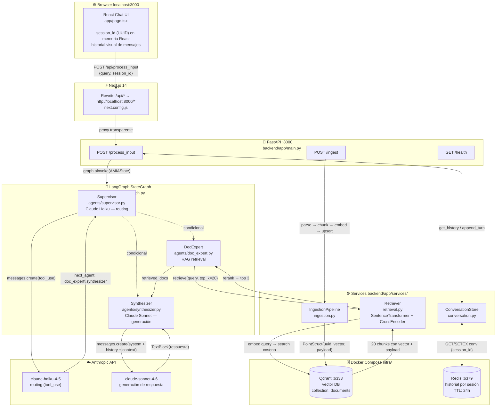
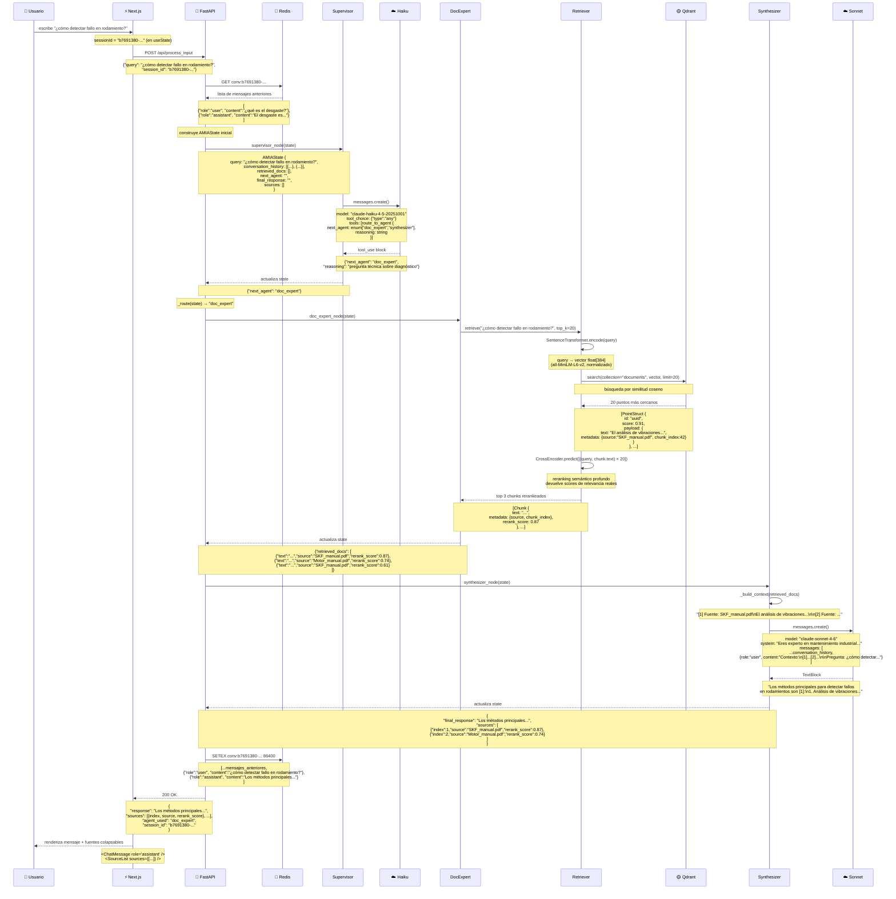

# AMIA V1 — Arquitectura y flujo de datos

Tres diagramas complementarios para entender el sistema:

| Diagrama | Pregunta que responde |
|----------|----------------------|
| 1 — Componentes | ¿Qué piezas existen y cómo se conectan? |
| 2 — Secuencia con payloads | ¿Qué pasa exactamente y con qué datos? |
| 3 — Contratos de datos | ¿Cómo está definida cada estructura? |

---

## Diagrama 1 — Arquitectura de componentes



**Lectura clave:**
- El proxy de Next.js es invisible para el usuario: `/api/process_input` → `:8000/process_input`
- LangGraph es el orquestador: decide qué nodo ejecutar en cada paso
- Qdrant y Redis son los únicos componentes con estado persistente
- La ingesta (`/ingest`) y el chat (`/process_input`) comparten Qdrant pero son flujos independientes

---

## Diagrama 2 — Secuencia con payloads

Cada flecha muestra el dato real que viaja en ese momento.



---

## Diagrama 3 — Contratos de datos

Las estructuras exactas que circulan por el sistema.

```mermaid
classDiagram

    class InputQuery {
        +str query
        +str session_id
        --
        Pydantic model
        session_id: UUID auto-generado
        si no se envía en el request
    }

    class AMIAState {
        +str query
        +list~dict~ conversation_history
        +list~dict~ retrieved_docs
        +dict|None sensor_analysis
        +dict|None economic_impact
        +dict|None work_order
        +str next_agent
        +str final_response
        +list~dict~ sources
        --
        TypedDict — contrato entre nodos
        LangGraph lo pasa a cada nodo
        cada nodo devuelve solo los campos
        que modifica (merge parcial)
    }

    class Document {
        +str content
        +dict metadata
        +str doc_id
        --
        dataclass
        doc_id = md5(bytes)
        metadata: source, type, pages
    }

    class Chunk {
        +str text
        +dict metadata
        +str chunk_id
        +list~float~ embedding
        --
        dataclass
        chunk_id = uuid5(doc_id + index)
        embedding: float[384]
        metadata hereda de Document
        + chunk_index, total_chunks
    }

    class RAGConfig {
        +int embedding_dim = 384
        +str embedding_model
        +int chunk_size = 500
        +int overlap_size = 50
        +int retrieval_top_k = 20
        +int rerank_top_k = 3
        +str llm_model
        +str qdrant_host
        +int qdrant_port
        +str collection_name
        --
        dataclass — configuración global
        se instancia una vez en main.py
        y se pasa a todos los servicios
    }

    class RedisHistory {
        +list~TurnMessage~ turns
        --
        JSON en Redis como string
        clave: conv:{session_id}
        TTL: 86400s (24h)
        máximo 10 turnos (20 mensajes)
    }

    class TurnMessage {
        +str role
        +str content
        --
        role: "user" | "assistant"
        formato nativo Anthropic API
    }

    class APIResponse {
        +str response
        +list~SourceRef~ sources
        +str agent_used
        +str session_id
        --
        JSON devuelto por POST /process_input
    }

    class SourceRef {
        +int index
        +str source
        +str page
        +float rerank_score
        --
        referencia a documento citado
        index coincide con [1],[2] en texto
    }

    Document "1" --> "N" Chunk : se divide en
    Chunk --> AMIAState : retrieved_docs
    InputQuery --> AMIAState : query + history
    RedisHistory "1" --> "N" TurnMessage : contiene
    AMIAState --> APIResponse : final_response + sources
    APIResponse "1" --> "N" SourceRef : sources
```

---

## Regla de oro para escribir código nuevo

Cuando añadas un componente nuevo (V2: sensor analyst, V3: work order agent), hazte siempre estas preguntas:

```
1. ¿Qué campos de AMIAState lee mi nodo?      → son mis INPUTS
2. ¿Qué campos de AMIAState escribe mi nodo?  → son mis OUTPUTS (dict parcial)
3. ¿Necesito un servicio externo?             → crea una clase en services/
4. ¿Cómo lo inyecto en el nodo?               → patrón factory make_X_node(servicio)
5. ¿En qué condición llega el grafo a mi nodo? → añade arista condicional en graph.py
```

Ejemplo para V2 (sensor analyst):
```python
# INPUT  → state["query"] + sensor_data (nuevo campo en AMIAState)
# OUTPUT → {"sensor_analysis": {"risk": 0.87, "failure_mode": "bearing_wear"}}
# Servicio: PredictorService (carga el modelo XGBoost)
# Factory:  make_sensor_analyst_node(predictor)
# Arista:   supervisor decide → "sensor_analyst" cuando detecta machine_id en query
```
